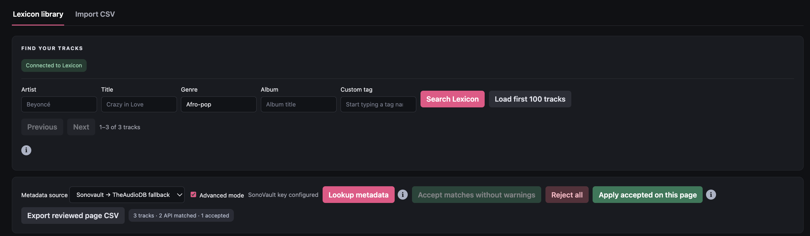
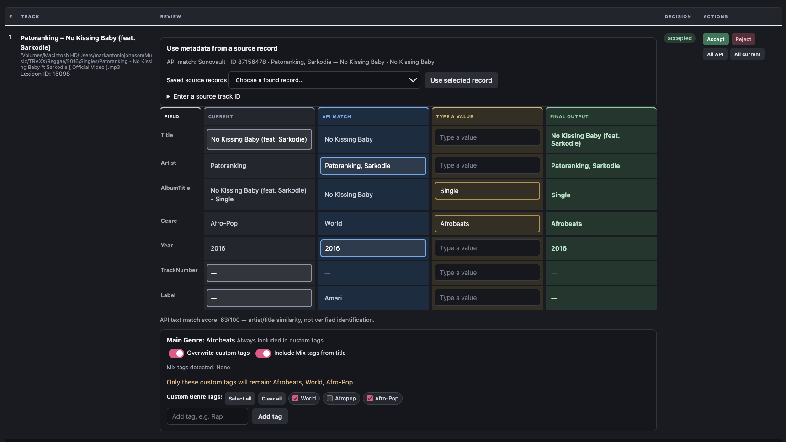

# Lexicon Metadata Reviewer

A local review tool for [Lexicon DJ](https://www.lexicondj.com/). Find metadata with TheAudioDB or SonoVault, compare it with your library, and choose exactly which values to keep before applying changes.

Built with Python’s standard library and HTML, CSS, and native JavaScript ES modules. No npm install, Python packages, cloud hosting, or build step is required to run it. This is an independent project, not affiliated with Lexicon, TheAudioDB, SonoVault, or BPM Supreme.

## Quick start

You need Python 3.10 or newer, a modern desktop browser, and Lexicon DJ running on the same computer. Internet access is needed for uncached provider lookups.

1. Download or clone this repository and open a terminal in its folder.
2. In Lexicon, open **Settings → Integrations** and enable **Local API**.
3. Start the reviewer:

   ```sh
   python3 server.py
   ```

   On Windows, use `py -3 server.py` if `python3` is unavailable.

4. Open **http://127.0.0.1:8765**. Keep the terminal open while using the app.
5. Open the **gear → Settings** to enter your provider key and choose defaults. Blank key fields keep the saved key. Press **Save settings** and confirm.

The reviewer attempts a connection on startup. If Lexicon is unavailable, an inline message explains setup and shows **Retry connection**. It does not retry in the background.

Use `Ctrl+C` to stop the server. After updating application code, stop and restart it, then refresh your browser. Opening `index.html` directly will not work.

> Before your first real batch, make a Lexicon database backup and try a few tracks you can verify. Lookup alone does not modify your library; applying and restoring require confirmation.



*Search your local library, choose a metadata provider, and start a lookup.*

## Review your tracks

1. Search your Lexicon library by artist, title, genre, album, or custom tag, or load the first 100 tracks.
2. Choose a metadata provider or fallback order, then click **Lookup metadata**.
3. Click individual values in **Current** or **API match**. **Final output** shows the values to apply.
4. Review the custom tags and version markers, then **Accept** the song.
5. Click **Apply accepted on this page** and review the confirmation.



*Keep values from different sources in the same track; the green column previews the final metadata.*

Only accepted songs on the current page are applied or exported. Changing a selection resets that song’s acceptance. The bulk-accept control excludes replacements, manual/source-record choices, low-confidence results, and warnings.

Search fields are combined with AND. Text search matches partial text, ignoring case; it is not typo-tolerant fuzzy search. Custom-tag suggestions support full labels or a uniquely matching partial label. Lexicon search can return at most 1,000 tracks; narrow your search if the app reports truncation.

**CSV mode** supports importing Artist/Title rows and exporting reviewed metadata. Include Location to retain file paths. CSV export does not write to Lexicon. `CustomTagAction` is a reviewer-specific column, not a guarantee that another importer will implement tag replacement.

## Advanced mode and title protection

Advanced mode reveals two additional sources:

- **Selected record:** reuse individual fields from a saved provider record, including when another version of the song did not match. Provider record IDs are shown separately from Lexicon track IDs. Cached IDs do not trigger a new provider request; unknown IDs require a lookup.
- **Type a value:** typing automatically selects your value. Empty text intentionally clears a text field. Year and track number require nonnegative whole numbers.

Turning Advanced mode off returns pending Record/Typed selections to Current and resets acceptance. The drafts remain available during the session.

A **Version title protected** tooltip explains when words such as Clean, Extended, Remix, or Instrumental are detected in the title, file path, mix, or remixer. The app keeps the original title to avoid dropping version details; other metadata remains editable. This is a text heuristic, not audio identification, and can be conservative.

## Genres and custom tags

The read-only **Main Genre** display follows the final Genre selection. API and source-record genres use the first parsed genre; Current and Typed use their selected value. Every nonempty final genre is automatically included in the custom tags, even after **Clear all**.

- **Overwrite off:** keep existing custom tags and add the final genre plus checked tags.
- **Overwrite on:** replace the song’s complete custom-tag list with the final genre plus checked tags and any enabled detected Mix tags. Unselected Mood, Mix, and other category tags are removed from that song.
- **Include Mix tags from title:** when overwriting, also include displayed markers such as Clean, Extended, Intro, or Instrumental. It does not rename the audio file.

Existing tag labels are reused without moving categories. New detected version tags go in Mix; other new tags go in Genre. Clear all clears optional selections, not the automatic final-genre tag. An overwrite clears every tag only when the final genre is empty and no optional or Mix tags remain.

## Configuration

On first startup, the app creates a private **`.env`** beside `server.py`. You may also copy `.env.example` to `.env` before starting. Settings saves update this file immediately; changes are confirmed before saving.

| Variable | Default | Purpose |
| --- | --- | --- |
| `SONOVAULT_API_KEY` | empty | Your SonoVault API key |
| `AUDIODB_API_KEY` | `123` | TheAudioDB key; replace with your own if required |
| `ADVANCED_MODE` | `false` | Show Record and Typed sources |
| `OVERWRITE_CUSTOM_TAGS` | `false` | Default action for newly loaded songs |
| `INCLUDE_MIX_TAGS_FROM_TITLE` | `true` | Include detected Mix tags when overwriting |
| `SHOW_DEBUG_LOG` | `false` | Display the debug panel |
| `THEME` | `system` | `light`, `dark`, or `system` |

System appearance follows OS changes while the page is open. Tag defaults apply to newly loaded, uncached songs; existing review choices are kept. API keys supplied as process environment variables override keys in `.env`.

The `.env` parser accepts `NAME=value`, quoted strings, and whole-line comments. It does not execute commands or expand shell variables. Use Settings to avoid quoting mistakes. Saved keys are never returned to the browser; `********` is only a placeholder.

For existing installations, a missing `.env` is created from the old `config.json` if present. The old file is left untouched as a private migration backup and is no longer used once `.env` exists. Both files are ignored by Git. You can remove the legacy file after verifying your settings.

Check provider access requirements before using your own account:
[TheAudioDB](https://www.theaudiodb.com/free_music_api) · [SonoVault](https://sonovault.now/).

## Cache and restore history

Private files are stored alongside `server.py`:

| File | Contents |
| --- | --- |
| `.env` | API keys and preferences |
| `metadata-cache.sqlite3` | Provider search responses and source records |
| `change-history.json` | Before/after snapshots of reviewer writes |

**Settings → Clear metadata cache** clears saved provider results and the current page’s source-record cache. It keeps settings, change history, and current review selections. Future lookups contact providers again. Refresh other open tabs to discard their in-memory caches. Cache entries do not expire automatically.

**Change history** retains the last three verified changes **per song**, keyed by Lexicon track ID. A durable backup is saved before the write; if it cannot be saved, the write stops. Restore the newest change first. Restore checks for conflicting newer values and changes only the fields recorded in that entry.

History records filenames and full paths before/after writes and at restore. A renamed track can still be identified by its Lexicon ID, but the app does **not** monitor external renames or rename physical audio files during restore. The history is not a backup of your audio files or entire Lexicon database.

If a network failure leaves a write’s outcome uncertain, its original values remain in the log and further writes to that song are blocked. Inspect the song and history before proceeding; automatic recovery of uncertain entries is not implemented. Changes made before logging was installed cannot be recovered.

## Troubleshooting

- **Cannot connect:** keep Lexicon running, enable Local API, and press Retry connection. Start the reviewer through `server.py`.
- **Outdated server/settings error:** stop the old process with `Ctrl+C`, restart, and refresh. Edit the `.env` in the same folder as the running server.
- **Port 8765 already in use:** another reviewer may be running. Stop it before starting a second instance.
- **TLS/certificate error:** use a Python installation with a working certificate store. Verified HTTPS stays enabled; on macOS, the app can use `/etc/ssl/cert.pem` when Python has no roots. Explicit `SSL_CERT_FILE`/`SSL_CERT_DIR` settings are respected.
- **Wrong or missing provider match:** inspect the artist/title similarity and record ID. Try another provider or Advanced mode; do not assume a match identifies a particular DJ edit.
- **Cannot save:** the app folder must be writable. Private settings/history/cache files can contain credentials or personal library paths—do not attach them to public bug reports.

## Privacy and known limits

The server listens on `127.0.0.1:8765` and is intended for one local user. Do not expose it to the network or deploy it as a public web service. Provider lookups send the searched artist/title or provider record ID to the selected provider. No audio is uploaded by this tool.

Review decisions are retained across page navigation but are **not saved across browser refreshes**. Avoid simultaneous edits to the same tracks in multiple tabs or apps: Lexicon API writes and local history are not a shared database transaction. History is tied to Lexicon IDs; do not reuse an old history file with an unrelated/rebuilt library.

The interface supports modern desktop browsers. Automated tests use mocks and temporary files; verify a small real-library workflow on your platform before relying on it for large batches.

## Development and tests

Python has no third-party runtime dependencies. Node.js is needed only for the JavaScript tests.

```sh
python3 -m unittest discover -s tests -p 'test_*.py'
```

On macOS/Linux:

```sh
for test in tests/*.cjs; do
  node "$test" || exit 1
done
```

Tests cover configuration creation/migration, secret handling, parser behavior, tag operations, themes, connection flow, cache behavior, and journal/restore safeguards. They do not write to your live Lexicon library.

Contributions and forks are welcome. Include a clear reproduction and relevant test results with fixes. Never include `.env`, cache/history files, real keys, or private library data in commits or issues. See `.env.example` for public defaults. See [LICENSE](LICENSE) for the terms governing use and redistribution.

## Source layout

- `index.html`: page structure and dialogs.
- `styles/base.css`, `styles/themes.css`: layout/components and appearance variants.
- `js/app.js`: startup, event bindings, and the explicit bridge for inline row controls.
- `js/state.js`, `js/dom.js`, `js/utils.js`: shared state, DOM references, and utilities.
- `js/model.js`, `js/review.js`, `js/render.js`: review rules, user actions, and rendering.
- `js/api.js`, `js/lexicon.js`, `js/metadata.js`: HTTP requests, library operations, and metadata providers.
- `js/tags.js`, `js/csv.js`, `js/settings.js`, `js/history.js`: feature modules.
- `server.py`: local HTTP service and provider cache/proxy.
- `config_store.py`, `change_history.py`: private configuration and durable change history.
- `tests/`: Python unit tests, JavaScript behavior regressions, and native ES-module integration tests.

Modules use browser-native imports; no bundler is required. The server explicitly allows only public HTML, JavaScript, CSS, and logo paths. When adding a public asset, update that allowlist and its test. Never allow an entire directory of private application files.

`node tests/modules.cjs` checks real ES-module linking, startup, UI handlers, and a mocked apply flow. It automatically enables Node’s experimental VM-module flag for this test only. Older behavior suites use the compatibility helper in `tests/helpers/frontend.cjs` to retain their existing mocks.

## License

Free for personal and professional use, including paid DJ work. You may modify, fork, and redistribute the app for free, retaining the license and copyright notices. **Selling the app or modified versions, charging for access, or bundling it into a paid software product requires written permission.**

Licensed under the custom [Lexicon Metadata Reviewer Source-Available License](LICENSE). See the [licensing guide](docs/LICENSING.md) for examples. This is source-available software, not an OSI-approved open-source release.

## AI tag lab (OpenRouter)

Open **AI tag lab** in the header, or visit `/ai-lab.html`. This separate experiment page never updates Lexicon. Save your OpenRouter API key and an explicit model ID, then review the starter dataset and run an evaluation. Settings are kept in the private `.env` as `AI_API_KEY`, `AI_BASE_URL`, and `AI_MODEL`. Existing installations use defaults until you save these settings.

Find current model IDs and prices at [OpenRouter models](https://openrouter.ai/models). You can select a free model when available; free quotas and availability may change. Prefer a fixed model ID for comparisons. Routing aliases may choose different models; each run records the resolved model returned by the provider. The compatible base URL can also be changed for local or other providers.

`evals/tag-benchmark.json` contains seven editable starter examples, including mix versions and an unknown track. These labels are illustrative, not verified ground truth. Build a larger, representative dataset using your own reviewed genre, mood, and mix labels. Each row has a unique `id`, `artist`, `title`, and `expected_tags` array. Import/export JSON from the lab to reuse datasets. Only artist and title are sent to the provider; expected tags stay local. No audio or filenames are uploaded.

Every run sends fresh requests, one per test (maximum 50), with no retry or fallback. It attempts every track even if earlier requests fail. Each failed track shows its error (such as HTTP status, timeout, truncated output, or invalid tag JSON). Raw provider error bodies are not displayed because they may contain credentials. Paid models can incur charges; the run button confirms the request count. Keep the page open while a run completes. AI requests default to a 120-second timeout. Set **AI timeout (seconds)** in AI lab settings from 15 to 300 seconds (`AI_TIMEOUT_SECONDS` in `.env`). This applies to main-app lookups and all benchmark modes. Existing configurations without this setting use 120 seconds. Retries remain disabled. Saved runs record the timeout; changing it does not invalidate successful cached metadata. A timeout does not guarantee provider cancellation or zero charges.

Results show precision, recall, F1, model-reported confidence, and Brier error for suggested tags. Matching ignores case and whitespace but does not equate genre synonyms. Missing expected tags reduce recall; additional tags reduce precision. The summary F1 averages over the entire dataset, counting failed/unattempted cases as zero. Empty predictions on empty expected labels count as correct abstention. Brier error only measures suggested tags, so it must be considered alongside recall. These metrics measure agreement with your labels, not objective musical truth.

The last 50 runs are saved privately in `ai-evaluation-runs.json` (gitignored), separate from the metadata cache. Clearing the metadata cache does not delete evaluations. Export runs for long-term comparisons; exports include the dataset, prompt/version, dataset hash, requested and returned model IDs, usage if supplied, timing, errors, and scores. Compare the same dataset hash and prompt version over time. Model confidence is self-reported and should not be treated as calibrated reliability. No live provider calls are made by the automated tests.

The Capleton “Good in Her Clothes” case uses user-supplied expected albums `Hotta Fire` or `Hotta Fire Riddim` and release year `1999`. Optional `expected_albums` lists acceptable aliases; `expected_year` checks the year only. These checks are shown separately from tag F1. `expected_tags: null` skips tag scoring when no reference tags have been provided (unlike `[]`, which expects abstention). Album/year expectations are never sent to the model. Prompt `tags-v2` requests album/year alongside tags; compare runs with the same prompt version.

AI lab **Max response tokens** defaults to 4,096 and can be set from 256 to 32,768 (`AI_MAX_TOKENS` in `.env`). Existing configurations without the setting use 4,096 automatically. Each saved run records its token limit. Increase it if a model truncates its JSON; provider model limits still apply. No automatic retries are performed.

### Web-backed evaluations

AI lab now defaults to **Search the web**, using OpenRouter's web-search server tool with Exa and a three-result total cap per track. Search has additional charges, including with free models. Switch it off to compare memory-only responses. The model is instructed to retrieve evidence first, but may not use the tool: results without provider URL citations explicitly say grounding is unverified. Sources are clickable; model-supplied URLs are labeled unverified and do not prove a search occurred. A citation does not by itself verify every returned field. No paid requests run automatically.

Use optional `tag_aliases` to map a canonical label to alternative spellings, e.g. `"tag_aliases": {"R&B": ["Rhythm and Blues", "R and B"]}`. `acceptable_tags` lists optional approved extras: these are not required for recall and do not reduce precision. Extras outside the reference are labeled unreviewed, not automatically false; review sources and add acceptable ones to your dataset. Starter expectations remain illustrative. All expectations stay out of the model prompt. Runs record web mode and scoring version; comparisons require matching settings and dataset.

### Comparing up to three models

Set Model 1 and optionally Model 2/3 in the lab, then save settings. Each nonempty, unique model runs against the same dataset and prompt settings, sequentially with no retries; seven tracks with three models means 21 requests. Each model searches independently when web search is enabled, so search charges repeat and retrieved evidence may differ. The confirmation shows the request count before running.

Saved evaluations show per-model scores, a side-by-side per-track table, and text-based agreement counts (not a truth/confidence score). Errors never vote. Full confidence, sources, album/year checks, usage, and errors remain available in the detailed rows/export. Optional slots persist as `AI_MODEL_2` and `AI_MODEL_3` in private `.env`. Older single-model runs remain readable.

### Random model discovery

In **Discover a better model**, set a model count (1–3), input/output price ceiling per million tokens, and a key-credit budget. **Preview random models** fetches the current OpenRouter catalog, filters for text output, context/output capacity and tool support when search is on, and randomly samples unique models. Eligible Model 1 is included as the incumbent baseline. Router aliases are excluded. Preview captures dataset and settings for 15 minutes; it does not query models. Confirm **Run selected models** to start paid evaluation.

Use a dedicated OpenRouter API key with a non-resetting credit limit and remaining credit at or below the chosen budget, with BYOK included in the limit. The app verifies this before random runs. Provider key enforcement bounds charges; catalog prices alone cannot guarantee a total because search and provider routing affect cost. This workflow does not change or create your OpenRouter keys. Standard manual runs retain their existing behavior.

Leaderboard quality averages available tag F1, album correctness and year correctness per track. Failed predictions score zero. Artist groups stay together in a deterministic training/holdout split to keep song versions together. Ranking uses training score, then failures, reported cost (unknown last), and speed. Holdout does not choose the top model; it checks that training winner. Reported cost is unavailable when any request lacks cost data.

Automatic selection requires the reviewed-dataset checkbox, at least 20 tracks / 5 artists with 15 training and 5 holdout tracks, zero winner failures, at least 80% on both splits, and a tested incumbent. A challenger must beat the incumbent by at least five percentage points on each split. Otherwise the winner is provisional and settings stay unchanged. A qualified winner becomes Model 1 and clears optional comparison slots, unless settings changed during the run. With only seven starter tracks you get a leaderboard, not automatic promotion. Selection is for future AI lab runs; the main library metadata workflow is unchanged. Benchmark history saves the sampled candidates, prices, split IDs, leaderboard and selection eligibility.

### AI in the main reviewer

Choose **AI / OpenRouter (Model 1 from AI lab)** in Metadata source, then **Lookup metadata**. Set the key/model/web-search preference in AI tag lab first. Normal lookup uses only Model 1, not all comparison slots. The confirmation explains provider charges and that artist/title plus the allowed custom-tag taxonomy are sent to the provider. Results appear in API Match for per-field selection, with sources, self-reported tag confidence and warnings. AI suggestions require individual acceptance and are excluded from bulk acceptance without warnings. Apply and Restore use the existing history workflow.

The backend reads Lexicon's **Genre custom-tag category**, never the track Genre-field inventory, to constrain main genre. Subgenre, Mood and Mix suggestions must match existing labels in their own categories. Unknown suggestions are discarded and reported; an unresolved main genre retains the current value. Existing compound genre labels such as R&B/Soul/Funk stay intact. Typed values remain manual user choices. Before applying AI selections, current tag membership is checked; AI tags are reused by ID rather than created in a different category.

AI supplies album, year, main genre and custom tags, plus optional title, credited-artist and record-label suggestions. Title and artist default to Current; select API Match explicitly to use a suggestion. Version-protected titles remain locked. Track number retains its current value. Lookup results are cached privately in the existing metadata SQLite cache, keyed by artist/title, model, endpoint, token limit, web setting, taxonomy and integration version. **Clear cache** in Settings also clears AI lookups. Lab evaluations continue to bypass this cache. No AI changes are automatically applied to Lexicon.

### Wikipedia evidence in library lookups

**Prefer Wikipedia song evidence** (AI lab settings, default on, `AI_WIKIPEDIA`) fetches English Wikipedia through its MediaWiki API before a new main-app AI lookup. A conservative match requires the song page title and artist attribution in the first song/single infobox. Ambiguous, missing, or unavailable pages fall back to the existing AI behavior with a warning. Remix/bootleg/mashup/refix titles skip original-song reuse. Bracketed clean/instrumental edits may use original-song evidence with a version warning.

Review shows original infobox genre, album and release text alongside the AI main-genre mapping, page link, revision and retrieval timestamp. Evidence is provided to the model as untrusted data; taxonomy enforcement remains unchanged. Wikipedia is evidence, not a guarantee of correctness. The prompt asks models to abstain on conflicting facts, but this is not an automated conflict-verification system.

The existing metadata cache stores evidence with its AI result. Clear cache to retrieve updated Wikipedia revisions. Existing cache entries are bypassed by the new integration version. The Wikipedia setting currently affects main-app lookups only, not lab benchmarks; general OpenRouter web search remains independently configurable. Wikipedia requests have no model charge, but their evidence adds input tokens to AI requests.

### AI pricing pills

The main AI source and each model slot in the lab show OpenRouter catalog prices in USD per million input/output tokens. Rates are fetched from the public model catalog and cached for five minutes; the tooltip shows the check time. They are advertised token rates, not a total quote: search, context tiers and provider differences can affect charges. Missing or unsupported model pricing is shown as unavailable. Auto/auto-beta show variable pricing because the routed model determines the rate. Results show the resolved model and reported request cost when OpenRouter supplies them; cached library results label this as the original lookup cost. Merely viewing pricing makes no inference requests.

OpenRouter requests default to prompt-based JSON output for broad model compatibility. Optional **Request JSON mode** (`AI_JSON_MODE=true`) sends response_format=json_object; it is off by default and never forces require_parameters. Enable it only for compatible models. The parser accepts a single complete JSON object surrounded by fences or commentary, but rejects malformed JSON, duplicate keys and ambiguous multiple objects. No repair-model requests or retries are made.

AI and Wikipedia searches remove recognized DJ edit markers from search titles, including Clean, Super Clean, Dirty, Raw, Explicit, Instrumental and Extended in brackets or trailing suffixes. Original titles remain unchanged; AI receives the local markers separately for Mix suggestions. Named remix information is retained. Benchmark reference labels are never included in requests.

### Discogs source
Select **Discogs** in the library metadata source menu. Add a personal access token in Settings (stored privately as `DISCOGS_API_KEY` in `.env`; blank retains it). Search retrieves up to ten release candidates; use the per-track release picker to select an edition. The first candidate is displayed for individual review, not automatically accepted. Genres/styles are release-level evidence, and release years can be reissue years. Exact matching labels reuse existing Lexicon custom tags; unmatched labels remain visible as warnings. No AI inference is used. Responses are stored in the local metadata cache; Clear cache refreshes them. Title/artist suggestions require a unique matching track title. Discogs data links back to the source release.
